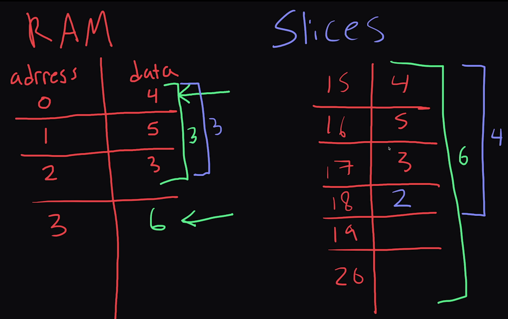

# Make



Most of the time we don't need to think about the underlying array of a slice. We can create a new slice using the `make` function:

```go
// func make([]T, len, cap) []T
mySlice := make([]int, 5, 10)

// the capacity argument is usually omitted and defaults to the length
mySlice := make([]int, 5)
```

Slices created with `make` will be filled with the zero value of the type.

If we want to create a slice with a specific set of values, we can use a slice literal:

```go
mySlice := []string{"I", "love", "go"}
```

Note that the array brackets _do not_ have a `3` in them. If they did, you'd have an _array_ instead of a slice.

## Length

The length of a slice is simply the number of elements it contains. It is accessed using the built-in `len()` function:

```go
mySlice := []string{"I", "love", "go"}
fmt.Println(len(mySlice)) // 3
```

## Capacity

The capacity of a slice is the number of elements in the underlying array, counting from the first element in the slice. It is accessed using the built-in `cap()` function:

```go
mySlice := []string{"I", "love", "go"}
fmt.Println(cap(mySlice)) // 3
```

Generally speaking, unless you're hyper-optimizing the memory usage of your program, you don't need to worry about the capacity of a slice because it will automatically grow as needed.

## Assignment

We send a lot of text messages at Textio, and our API is getting slow and unresponsive.

If we know the rough size of a slice before we fill it up, we can make our program faster by creating the slice with that size _ahead of time_ so that the Go runtime doesn't need to continuously allocate new underlying arrays of larger and larger sizes. By setting the length, the slice can still be resized later, but it means we can avoid all the expensive resizing we **know** that we'll need.

Complete the `getMessageCosts()` function. It takes a slice of messages and returns a slice of message costs.

1. Preallocate a slice for the message costs of the same length as the `messages` slice.
2. Fill the costs slice with costs for each message. The cost in the cost slice should correspond to the message in the messages slice at the same index. The cost of a message is the length of the message multiplied by `0.01`.
